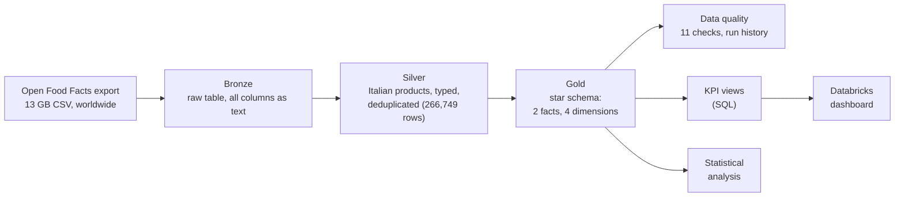
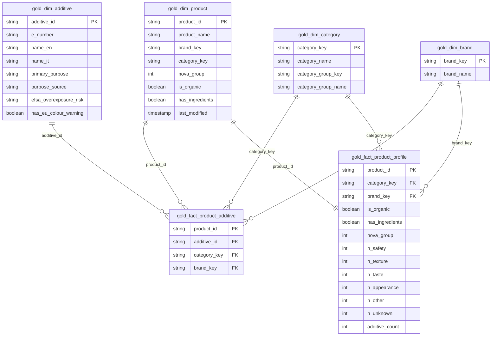
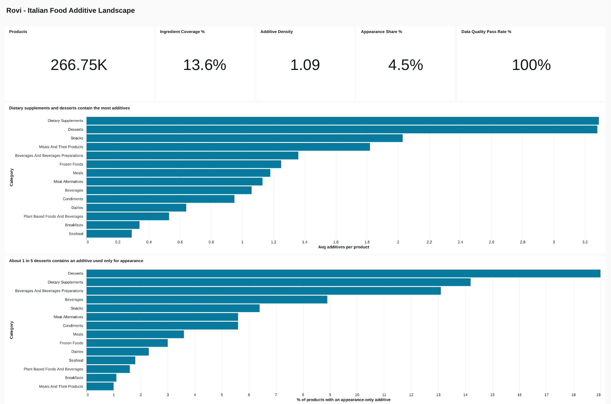
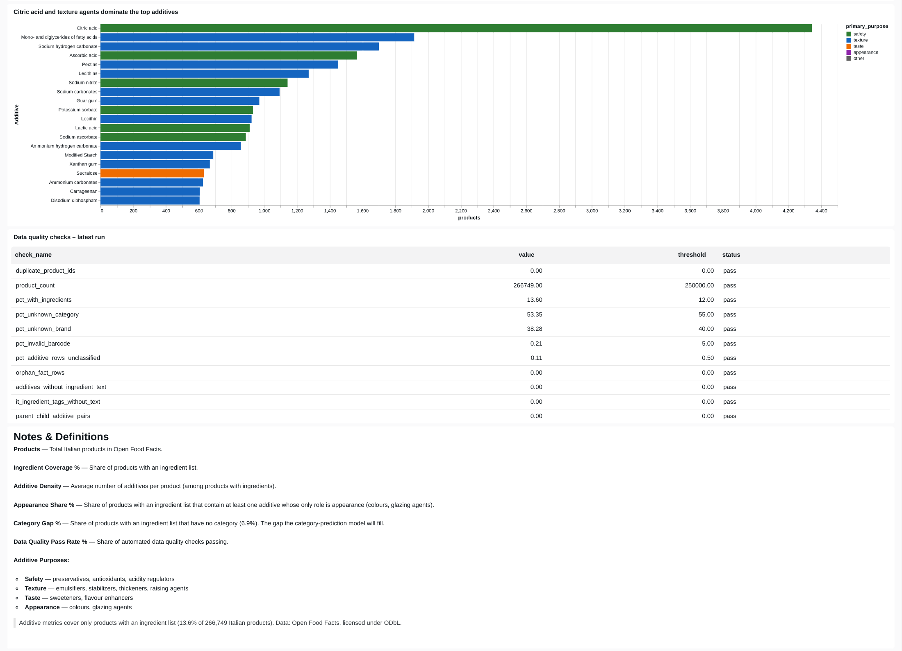

# Rovi Data Pipeline: Italian Food Additive Landscape

An end-to-end BI project on **266,749 Italian food products** from Open Food Facts: a Databricks ETL pipeline (bronze → silver → gold), a star-schema data model, automated data quality checks, KPI definitions as SQL views, a dashboard and a statistical analysis.

Built for **Rovi**, a student food-transparency startup, to answer one business question:

> **Which product categories and additives should the app explain first?**

The full write-up is in [`docs/analysis.md`](docs/analysis.md).

---

## Key results

| Finding | Number |
|---|---|
| Italian products with an ingredient list | **13.6%** (36,277 of 266,749) |
| Average additives per product (with ingredients) | **1.09** |
| Share of additive occurrences in snacks | **34.8%** (snacks + plant-based: 52.5%) |
| Share of occurrences covered by the top 20 additives | **60.3%** (of 355 in use) |
| Desserts with an appearance-only additive (colours, glazing agents) | **~19%** |
| Organic vs. non-organic, same category | **58% fewer additives** (rate ratio 0.42, 95% CI 0.39–0.45) |
| Automated data quality checks passing | **11 / 11** |

**Recommendation:** start the additive knowledge base with the top 20 additives and the categories where they occur most (snacks, plant-based foods), add context for meats and appearance-only additives, and prioritise label-photo scanning, because barcode lookup alone covers too few products.

---

## Architecture



| Layer | Notebook | What happens |
|---|---|---|
| Bronze | `01_load_open_food_facts.py` | Reads the compressed tab-separated export with PySpark, keeps every column as text, normalises column names |
| Silver | `01_load_open_food_facts.py` | Filters to Italy, converts tag strings to arrays, casts types, removes duplicate barcodes |
| Gold | `02_gold_star_schema.py` | Builds the star schema, classifies each additive by purpose, removes parent/child double counting |
| Quality | `03_data_quality.py` | Runs 11 checks against thresholds and appends results to a history table |
| Metrics | `04_metrics.py` | Defines KPIs once as SQL views used by the dashboard |

---

## Data model



- **`gold_fact_product_additive`**: one row per product–additive pair (a factless fact table).
- **`gold_fact_product_profile`**: one row per product, with additive counts by purpose.
- Natural keys (barcode, E-number, category tag) are used because they are stable in the source.
- Tags missing from the additive dictionary are kept as **unknown members** instead of being dropped, so every fact row stays joinable.

Schema source for dbdiagram.io: [`docs/schema.dbml`](docs/schema.dbml).

---

## Data quality

`03_data_quality.py` runs 11 checks after every load and appends the results to `dq_results`, so quality can be tracked over time. Thresholds are set just past the current baseline, so they catch regressions rather than known gaps.

| Check | Rule | Severity |
|---|---|---|
| Duplicate product IDs | = 0 | fail |
| Product count | ≥ 250,000 | fail |
| Orphan fact rows | = 0 | fail |
| Parent/child additive pairs on one product | = 0 | fail |
| % products with ingredients | ≥ 12% | warn |
| % unknown category / unknown brand | ≤ 55% / ≤ 40% | warn |
| % invalid barcodes (not EAN-8/UPC-A/EAN-13/GTIN-14) | ≤ 5% | warn |
| % additive rows unclassified | ≤ 0.5% | warn |
| Additives without ingredient text | = 0 | warn |
| Italian products with ingredient tags but no text | = 0 | warn |

### Issues found and fixed

1. **Double counting (−14% on a core metric).** Open Food Facts tags both a parent code and its sub-type (e.g. E322 and E322i) on the same product. Additive density was overstated at 1.24; keeping only the most specific code corrected it to 1.09. A dedicated check now guards against regressions.
2. **Mislabelled multi-function additives.** The rule "safety wins when an additive has several functions" labelled lecithin (emulsifier + antioxidant) as a preservative-type additive. Five common additives now use a documented override list, and `purpose_source` records whether each label came from the rule or an override.
3. **Tags outside the E-number taxonomy.** 44 rows (0.1%) referenced nutrients, combined raising agents or untranslated tags. They are stored as unknown members rather than dropped.
4. **Coverage gap verified at source.** Only 13.6% of products have ingredient text. The export has a single ingredient column and no recoverable ingredient tags, so the gap is in the data, not the pipeline.

---

## Metrics

KPIs are defined once as SQL views, so the dashboard and the analysis always use the same logic. Definitions: [`docs/metrics.md`](docs/metrics.md).

| View | Grain | Used for |
|---|---|---|
| `v_kpi_summary` | one row | KPI tiles |
| `v_category_metrics` | category group | category charts |
| `v_additive_usage` | additive | top-additive chart |

---

## Dashboard

Built in Databricks AI/BI on the views above. The definition is in [`dashboards/additive_landscape.lvdash.json`](dashboards/additive_landscape.lvdash.json) and can be imported into any Databricks workspace.

Full dashboard as PDF: [`docs/dashboard.pdf`](docs/dashboard.pdf)




---

## Statistical analysis: do organic products contain fewer additives?

Organic products cluster in categories that already have few additives (plant-based foods, breakfasts), so a simple comparison mixes the organic effect with a category effect.

| Method | Result |
|---|---|
| Simple comparison | 0.40 vs 1.17 additives per product (−66%), Mann-Whitney p < 0.001 |
| Within each category (12 categories, ≥ 30 products per group) | Organic lower in all 12; significant in 9 after Bonferroni correction |
| Poisson regression with category fixed effects, robust SE | Rate ratio **0.42** (95% CI 0.39–0.45): **58% fewer** additives |

Controlling for category shrinks the gap from 66% to 58%. Medians are 0 in both groups: most products have no additives, and the difference lies in the minority of heavily processed products. The result is an association, not a causal effect.

---

## Repository structure

```
notebooks/      Databricks notebooks (exported as .py source)
dashboards/     Databricks AI/BI dashboard definition
docs/           Analysis write-up, metric definitions, schema, screenshots
reference/      Additive dictionary used for classification and the script that builds it
```

## How to run

1. Create a free Databricks workspace.
2. Download the Open Food Facts CSV export (`en.openfoodfacts.org.products.csv.gz`, about 1 GB compressed) and upload it to a Unity Catalog volume at `/Volumes/workspace/default/raw/`. Upload `reference/additives.json` to the same volume.
3. Import the notebooks and run them in order: `01` → `02` → `03` → `04`.
4. Import `dashboards/additive_landscape.lvdash.json` via **Dashboards → Import**.

## Limitations

- Open Food Facts is crowd-sourced: counts reflect products listed, not products sold.
- Products with an ingredient list may differ systematically from those without.
- Organic status relies on product labels; unlabelled organic products are counted as non-organic.
- Category shares exclude products without a category.

## Data and licence

Product data © Open Food Facts contributors, available under the [Open Database License (ODbL)](https://opendatacommons.org/licenses/odbl/1-0/). Additive classifications and EFSA references are derived from the Open Food Facts additives taxonomy. Code in this repository is released under the MIT License.
